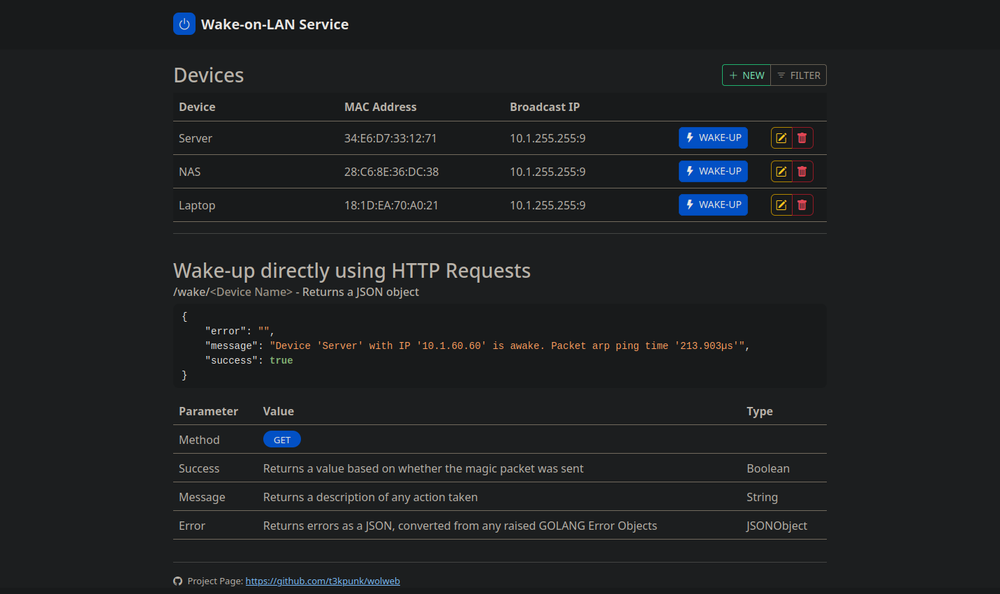

[](http://golang.org)
[](http://golang.org)
[](http://golang.org)

# Web interface for sending Wake-on-LAN (Magic Packet)

Fork from <https://github.com/sameerdhoot/wolweb>. I wanted to have a json response with the status of device. WOL is a L2 broadcast. To test the L2 connectivity, a arping is send directly after the WOL package.

This application is intended do be used in conjunction with a reverse proxy and secured with an SSL certificate. As the intended use case was with home networks, the application has no in-built authentication. While this could pose a slight security risk even if this was hacked to application is intended to be containerised so the attack surface if limited.

I have bookmarked direct link to device(s) on my browsers to wake them using single HTTP call for ease of access.

Use cases:

- Wake-up my home computers remotely, for access remotely over RDP.
- Integration with automated routines to allow parts of a home lab to sleep instead of running 24x7 to save energy.

## Bootstrap UI with JS Grid for editing data



The UI features CRUD operation implemented using [js-grid.com](https://github.com/tabalinas/jsgrid) plugin.

### Wake-up directly using HTTP Request

/wolweb/wake/**&lt;hostname&gt;** -  Returns a JSON object

```json
{
    "error": "",
    "message": "Device 'Server' with IP '10.1.60.60' is awake. Packet arp ping time '213.903µs'",
    "success": true
}
```

## Configure the app

The application will use the following default values if they are not explicitly configured as explained in sections below.

| Config | Description | Default
| --- | --- | --- |
| Host | Define the host address on which the webserver will listen | **0.0.0.0**
| Port | Define the port on which the webserver will listen | **8089**
| Virtual Directory | A virtual directory to mount this application under | **/wolweb**
| Broadcast IP and Port | This is broadcast IP address and port for the local network. *Please include the port :9* | **10.1.255.255:9**

You can override the default application configuration by using a config file or by setting environment variables. The application will first load values from config file and look for environment variables and overwrites values from the file with the values which were found in the environment.

**Using config.json:**

```json
{
    "host": "0.0.0.0",
    "port": 8089,
    "vdir": "/",
    "bcastip": "10.1.255.255:9"
}
```

**Using Environment Variables:**

*Environment variables takes precedence over values in config.json file.*

| Variable Name | Description
| --- | --- |
| WOLWEBHOST | Override for default HTTP host
| WOLWEBPORT | Override for default HTTP port
| WOLWEBVDIR | Override for default virtual directory
| WOLWEBBCASTIP | Override for broadcast IP address and port

## Devices (targets) - devices.json format

```json
{
    "devices": [
        {
            "name": "Server",
            "mac": "34:E6:D7:33:12:71",
            "ip": "10.1.255.255:9"
        },
        {
            "name": "NAS",
            "mac": "28:C6:8E:36:DC:38",
            "ip": "10.1.255.255:9"
        },
        {
            "name": "Laptop",
            "mac": "18:1D:EA:70:A0:21",
            "ip": "10.1.255.255:9"
        }
    ]
}

```

## Usage with Docker

This project includes [Dockerfile (based on Alpine)](./Dockerfile) and [docker-compose.yml](./docker-compose.yml).

> I could not get this to run using Docker's bridged network. The only way I was able to make it work was to use host network for the docker container. See this [https://github.com/docker/for-linux/issues/637](https://github.com/docker/for-linux/issues/637) for details.

### With docker-compose

```shell
docker-compose up -d
```

### Build and run manually

```bash
docker build -t wolweb .
docker run --network host -it wolweb
```

### Extract the compiled application from an image

```bash
docker cp wolweb:/wolweb - > wolweb.gz
```

## Build

You need Go 1.20 to build binary for any OS.

```shell
# Linux/macOS
go build -o wolweb .
```

### User permission sending arp package

```shell
setcap cap_net_raw,cap_net_admin=eip /usr/sbin/tcpdump
getpcaps 9562
sudo setcap cap_net_raw,cap_net_admin=eip wolweb
sudo getcap wolweb
cat /proc/net/arp
```

### gratuitous ARP's and WOL using tcpdump

```shell
tcpdump -vXAnn -i enp3s0 port 9
tcpdump -i eth0 arp and arp[6:2]==2
```

> To see detailed instructions on how to run this application as service on ASUS router with custom firmware [asuswrt-merlin](https://www.asuswrt-merlin.net/) see this [Wiki guide](https://github.com/sameerdhoot/wolweb/wiki/Run-on-asuswrt-merlin)

## NGiNX Config

I am already using NGiNX as web-proxy

```shell
worker_processes  1;
error_log /dev/stdout warn;

events {
    worker_connections  1024;
}

http {
    server_tokens off;
    include       mime.types;
    default_type  application/octet-stream;
    #access_log    /dev/stdout;

    sendfile           on;
    keepalive_timeout  65;

    upstream backend {
        server mercur:8089;
    }

    server {
        #server_name wol.eftasgmbh.local;
        listen 8090 ssl;
        ssl_certificate /etc/nginx/server.crt;
        ssl_certificate_key /etc/nginx/server.key;
        ssl_verify_client off;
        # Some security headers...
        add_header X-Frame-Options SAMEORIGIN;
        add_header X-XSS-Protection "1; mode=block";

        location / {
            limit_except GET HEAD POST { deny all; }
            add_header X-Frame-Options SAMEORIGIN;
            add_header X-XSS-Protection "1; mode=block";
            proxy_pass  http://backend/;
            proxy_set_header Host $http_host;
            proxy_set_header X_FORWARDED_PROTO https;
        }
    }
}

```

> I still have to build and test it op FreeBSD, it should work.

## Credits

This project is based on a couple of framworks and provided below:

- <https://github.com/dabondi/go-rest-wol> - Provided the initial project framework
- <https://github.com/sabhiram/go-wol> - Provided the functionality to the REST
- <https://github.com/sameerdhoot/wolweb> - Forked from this project
- <https://github.com/j-keck/arping> - arping to check L2 connectivity

## License

Distributed with GNU General Public License (c) 2023
